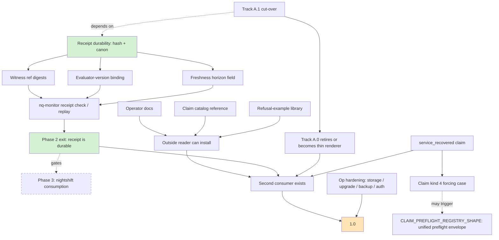

# NQ → 1.0: present, remaining, dependencies, slices

A calibration memo against the existing roadmap, oriented at time-allocation across NQ, nightshift, wicket. Not a request to start building — a parts list.

## Context

NQ is a 2-month-old solo project (226 commits, ~28k LOC Rust, 540+ tests, 47 SQL migrations, 50+ gap docs, Cargo `0.1.0`). The architecture is largely *named* and the spine is live: `nq.witness.v1` and `nq.receipt.v1` ship, three of four canonical contracts are wire-shipping, 8-verdict taxonomy is closed and tested, both Track A (operational) and Track B (CI receipts) have live evaluators and a GitHub Action.

The project already has a ratified roadmap: `docs/architecture/SPINE_AND_ROADMAP.md` lays out Phases 0–5. That doc is authoritative for sequencing. This memo answers a sharper question: **which subset of that roadmap + which non-roadmap work constitutes a 1.0 the author could hand to a stranger**, vs. continue carrying as personal infrastructure.

The frame matters less than it once seemed. The 2026-05-24 nightshift audit narrowed the cross-project claim: **Phase 2 unblocks future receipt-discipline consumption and optional Nightshift enrichments. Current Nightshift MVP work consumes finding/liveness wires and is not blocked on NQ receipt discipline.** NQ's path to 1.0 is therefore a single-project concern; the constellation does not need Phase 2 to clear before Nightshift can ship its MVP.

## Prior question: is 1.0 the right shape at all?

Before picking slices, name the meta-question this memo answers and the meta-question it doesn't.

NQ is the wedge into a broader constellation (NQ testimony / AG admissibility / standing identity / nightshift continuity-stress / wicket / WLP receipts). One reading of the cross-project state: NQ is *substrate* for that broader kernel and the right move is to keep it at 0.x indefinitely, because making NQ a leaf-shipped 1.0 risks making it stop composing with the constellation the way it currently does. A 1.0 tag and the operator-doc costume that comes with it might pull NQ into the gravitational orbit of "small monitoring tool" — which is precisely the costume the spine doc refuses.

The opposite reading: the carrying cost of "this is personal infrastructure I can't recommend to anyone" is itself a tax, and paying that tax (via outside-reader docs + op hardening + second consumer) doesn't change what NQ *is* — it changes who can see what it is.

This memo proceeds under the second reading, because the user's framing ("if it wasn't purely driven as a hobby") names a felt cost, not a strategic positioning. But the first reading is worth not losing. **If, on reading the slice map, the carry-cost relief is not the dominant felt-pain — if the felt-pain is actually "this composes badly with nightshift/AG/wicket and I can't see why" — then the slice map below is for the wrong question, and the right next move is a constellation-shape memo, not a 1.0 memo.**

## 1.0 invariants

NQ 1.0 must preserve:

- Finding ≠ claim.
- Witnesses observe; they do not promote.
- Receipts attest; they do not authorize mutation.
- NQ preflights assertions; it does not operate the system.
- Stronger unsupported claims must degrade to weaker admissible claims or refusal.
- Public wire contracts must be durable without trusting prose.
- New surfaces require an exit condition or a forcing case.

Every slice below should pass these as a cheap local test before it lands.

## What 1.0 means for this kind of tool

NQ is not a SaaS, not a platform, not a marketplace. It's a single-binary local-first claim/evidence engine with two consumer surfaces (CLI receipts for CI; HTTP+web for operational state). For *that shape*, 1.0 is:

1. **Wire contracts are durable.** A consumer can save a receipt today and verify it next year without trusting prose. (Hash, canonicalization, evaluator-version binding, witness-ref digests, freshness horizon, replay.) This is the only Phase that requires *invention* per the roadmap doc.
2. **Internal seams are paid down.** Track A.0 (`disk_state` reading `FindingSnapshot` directly) is the named "acknowledged carry"; 1.0 honesty wants it cut over to the shared spine, or the keeper rule loses force.
3. **At least one second consumer exists.** Today there's one operator (the author), one live demo. A second installation — anyone — that runs `nq-monitor serve` against their own host or `nq-monitor verify` in their own CI proves the spine externalizes.
4. **The docs lead with operator, not architecture.** 50+ gap docs are valuable but inside-baseball. An outside reader needs: install/upgrade/backup/troubleshoot path, claim catalog reference, refusal-example library, "how to write a witness" — in that order.
5. **Operational fundamentals hold.** Storage limits enforced, upgrade story tested, backup verified, auth/proxy guidance for non-private deployments.

Phase 3 (Nightshift consumption), Phase 4 (mutation gate), Phase 5 (effect probes), Postgres backend, federation, multi-tenant — **none of those gate 1.0**. The roadmap doc already classifies them as forcing-case-driven; 1.0 doesn't need them, and shipping them speculatively is the failure mode the project's own anti-sprawl rules name.

## What's already there

Roadmap-internal (per `SPINE_AND_ROADMAP.md`):

| Layer | State |
|---|---|
| Witness (`nq.witness.v1`) | live; packets ship with `observed_at` / `generated_at` / `coverage_limits` / `dependencies` |
| Claim registry | live; Leaf / Composite / NonMintable categories; Track B starter catalog hardcoded |
| Preflight / evaluator | live; 8-verdict taxonomy closed; per-kind wire schemas for `disk_state`, `ingest_state`, `dns_state`; Track B `claim_registry::evaluate` |
| Receipt (`nq.receipt.v1`) | DTO + four renderers ship; hash / binding / replay are the Phase 2 gap |
| Surface | CLI (`nq-monitor verify`, `nq-monitor witness {git-status,pytest,diff-scope}`, `nq-monitor preflight disk-state`, `nq-monitor probe dns`, `nq-monitor smoke …`); HTTP preflight endpoints; web UI; GitHub Action |
| Substrate | 19 shipped gap docs: EVIDENCE_LAYER, GENERATION_LINEAGE, FINDING_DIAGNOSIS, FINDING_EXPORT, REGIME_FEATURES (V1), DOMINANCE_PROJECTION (V1), STABILITY_AXIS, GENERALIZED_MASKING (V1), TESTIMONY_DEPENDENCY (V1), COVERAGE_HONESTY (V1), MAINTENANCE_DECLARATION (V1), OPERATIONAL_INTENT_DECLARATION (V1), DURABLE_ARTIFACT_SUBSTRATE (V1), FLEET_INDEX (V1), SENTINEL_LIVENESS (V1), ZFS_COLLECTOR (Phases A/B/C), EVIDENCE_RETIREMENT (V1.0 substrate), … |

Operational:
- One live production probe at `nq.neutral.zone`
- CI (`cargo test --all` + gap-status discipline script)
- Release workflow producing musl static binaries (linux-amd64, linux-arm64)
- systemd units + example configs in `deploy/examples/`
- Notification engine (webhook / Slack / Discord) with durable identity, cooldown, `(recurring)` semantics

Doctrine:
- Spine + roadmap doc ratified (2026-05-20)
- Product surfaces doc ratified (one engine, two costumes)
- Anti-sprawl rules codified ("no new layer without an exit condition", "every phase must retire, simplify, or kill something")

## What's left for 1.0

### Roadmap-internal (named in `SPINE_AND_ROADMAP.md`)

| Phase | Work item | Status |
|---|---|---|
| 0 (consolidate) | Canonical-example set (3–5 claim kinds) in repo docs | not started |
| 0 (consolidate) | Track A.1 cut-over (`DISK_STATE_CUTOVER_TO_SHARED_SPINE`) | gap doc landed; impl deferred |
| 1 (operational wedge) | `service_recovered` / `service_state` claim kind | witness shape undecided |
| 1 (operational wedge) | Refusal-example library (published operator-facing doctrine) | not started |
| 2 (receipt discipline) | Witness ref digests (populate existing `digest` slot) | unpopulated slot |
| 2 (receipt discipline) | Receipt canonicalization + content hash | not started |
| 2 (receipt discipline) | Evaluator-version binding | partial (per-kind contract versions exist) |
| 2 (receipt discipline) | Explicit freshness-horizon field | implicit via `observed_at_min/max` |
| 2 (receipt discipline) | `nq-monitor receipt check` / `nq-monitor receipt replay` verbs | not started |

### Roadmap-external (1.0 readiness for outside use)

| Area | Work item |
|---|---|
| Docs for outsiders | Operator-facing entry path that doesn't route through 50+ gap docs |
| Docs for outsiders | Claim-catalog reference (which claim kinds exist, what witnesses they need, what they refuse) |
| Docs for outsiders | Refusal-example library (the Phase 1 item, but written for operators not designers) |
| Docs for outsiders | Cookbook: write-your-own-witness, write-your-own-claim |
| Operational hardening | Storage-budget enforcement validated (designed in `DESIGN.md §6`; verify shipped behavior) |
| Operational hardening | Upgrade test (real schema-version-skew between binary and DB) |
| Operational hardening | Backup verification (`VACUUM INTO` + restore-and-query test) |
| Operational hardening | Auth/proxy guidance for non-private deployments |
| Second consumer | One installation that is not the author's box (could be a friend, a CI in another repo, anything) |
| Second consumer | One claim kind authored by someone who doesn't know the codebase, to find the rough edges |

### Explicitly out of 1.0 (deferred by roadmap or by anti-sprawl rules)

- Phase 3 (Nightshift consumption) — gated on Phase 2
- Phase 4 (mutation gate) — needs a forcing case
- Phase 5 (effect-boundary probes) — needs a specimen
- Postgres backend (`STORAGE_BACKEND_GAP`) — contract-only, no `PgStore` per spec
- Witness-path assurance branch — parked, needs forcing case
- Most `proposed` gap docs (~19 of them) — no forcing case
- Federation, multi-tenant, dashboards-as-code, plugin marketplace, LLM adjudication — explicit non-implications of the spine

## Dependency shape

Edges to read:
- **A → F is the only hard sequence on the roadmap mainline.** Phase 2 work is the spine of everything downstream.
- **G (cut-over) is sequenced after A** so the cut-over targets the durable shape, not the in-flight one. If sequenced before, the cut-over has to be done twice.
- **I (service_recovered) is parallel to A.** It can land anytime; it may trigger K (registry shape generalization) but K is not gating 1.0.
- **Docs (L/N/O) and op hardening (S) are parallel to everything**, but they need at least Phase 2 to be settled before they can describe stable contracts.
- **Q (second consumer) is the integration test** for whether 1.0 actually works for non-authors.
- **Dashed edge P3 is post-1.0.** Phase 2's exit unblocks future receipt-discipline consumption (including optional Nightshift enrichments); current Nightshift MVP work runs on the finding/liveness wires and is not blocked on NQ receipt discipline. Nightshift does not gate 1.0.

## Slices (in dependency order, each ~1–2 focused sessions)

### Slice 1 — Receipt-durability foundation (Phase 2 invention)
The one piece of *invention* on the path. Decompose:
- **1a**: witness ref content-hash. Populate the `digest` slot that already exists on `WitnessRef`. Canonical JSON form for witnesses, SHA-256, plumb through `From<PreflightResult>`. Touch: `crates/nq-core/src/witness.rs`, `crates/nq-core/src/receipt.rs`.
- **1b**: receipt canonicalization + content hash. Canonical JSON, SHA-256, optional embedded hash field. Stamp evaluator version on every receipt. Touch: `crates/nq-core/src/receipt.rs`, `crates/nq-core/src/render.rs`.
- **1c**: explicit `freshness_horizon` field on `Receipt`, computed from per-claim policy. Touch: `crates/nq-core/src/preflight.rs`, `crates/nq-core/src/receipt.rs`.
- **1d** (Phase 2 exit minimum): `nq-monitor receipt check <file>` — structural verification only. Re-verify receipt hash, witness digests, canonicalization, schema/version sanity. Does not re-run the evaluator; does not need stored witnesses. Touch: `crates/nq/src/cmd/receipt.rs` (new), `crates/nq/src/cli.rs`.
- **1e** (1.0-critical but separate risk profile): `nq-monitor receipt replay <file>` — semantic re-evaluation. Re-runs the evaluator over stored witnesses, compares verdict. Requires stored witnesses, evaluator-version compatibility shim, freshness-policy interpretation. May land with a documented bounded limitation (e.g. "only replays receipts from the same major evaluator version").

Exit: 1d is the Phase 2 hard exit (open a receipt, verify its hash, done). 1e is the stronger property (open a receipt, re-derive its verdict from witnesses) and may ship with bounded limitations and still count as 1.0-shipped.

### Slice 2 — Track A.1 cut-over
`DISK_STATE_CUTOVER_TO_SHARED_SPINE` per its gap doc. `disk_state` evaluator stops reading `FindingSnapshot` directly; reads a projected witness packet built from ZFS/SMART findings. Acknowledged carry is paid down. Touch: `crates/nq-db/src/preflight.rs`, new projection in `crates/nq-db/src/export.rs` or sibling. Old path stays as a renderer over the new path during the transition.

Exit: the keeper rule "Witnesses observe. They do not promote." holds without an asterisk.

### Slice 3 — `service_recovered` / `service_state` claim *(target for 1.0, not a hard gate)*
Phase 1's named-but-not-built remaining item. Decide witness shape (probably reuses `service_status` collector observations), add claim kind + evaluator + HTTP endpoint + CLI smoke. This is the fourth claim kind, which is the explicit forcing-case threshold for `CLAIM_PREFLIGHT_REGISTRY_SHAPE_GAP` (registry generalization / unified `nq.preflight_result.v1`).

**Not a hard 1.0 gate.** If Slices 1, 2, 4, 5, 6 have landed and the existing three claim kinds (`disk_state`, `ingest_state`, `dns_state`) plus the Track B catalog feel sufficient for the wedge, ship 1.0 without `service_recovered`. The discipline test: is the absence of a fourth claim kind making the claim catalog feel anemic to outside readers in Slice 4 (refusal-example library / catalog reference)? If yes, do this slice. If not, defer past 1.0 as a forcing-case-driven item. Do not let "one more claim kind" become the classic release-delaying prestige feature.

Exit (if done): four claim kinds shipping; registry-shape generalization either gets forced now or is explicitly re-deferred with the reason recorded.

### Slice 4 — Outside-reader docs
Three documents, written for an operator who is not the author:
- **4a**: operator entry path. Either a new `OPERATOR_GUIDE.md` or a rework of `README.md` + `docs/operator/quickstart.md` so the path from "I just downloaded the binary" to "I have monitoring + receipts working" is one read. Avoid routing through gap docs.
- **4b**: claim catalog reference. One page listing every shipped claim kind, its required witnesses, its non_mintable companions, its refusal vocabulary.
- **4c**: refusal-example library. The "stronger claim refused / weaker claim admissible" pairs, written as worked examples not theory. This is Phase 1's named-but-not-built doc item.

Exit: a stranger reads three pages and can write their own `nq-monitor verify` invocation.

### Slice 5 — Operational hardening
Audit + close the items already designed in `DESIGN.md §6` and `AGENTS.md`:
- Storage-budget enforcement: write the test that exercises the "DB exceeds max → degrade gracefully" path. If unimplemented, implement.
- Upgrade test: build the binary at schema version N, point it at a DB at schema version N-1, observe automatic migration; verify no data loss.
- Backup verification: cron-friendly `VACUUM INTO` example, plus a restore-and-query test.
- Auth/proxy doc: explicit recipe for putting `nq-monitor serve` behind nginx/caddy with basic auth, since the README/quickstart assume private network. **Doc-only.** NQ does not grow native auth, TLS termination, OAuth, tenancy, or CORS hardening for 1.0. The 1.0 boundary is *operators get documented authentication and risk boundaries when they expose it via a conventional reverse proxy* — not *NQ becomes its own auth-handling service*.

Exit: an operator can plausibly expose `nq-monitor serve` through a conventional reverse proxy with documented authentication and risk boundaries, without writing their own ops doc.

### Slice 6 — Second consumer (validation, not invention)
Either:
- Find one person to install `nq-monitor serve` on their own host, log the friction, fix the top three rough edges.
- Or: ship `nq-monitor verify` in one external repo's CI, log the friction, fix the top three rough edges.

Exit: rough-edge log exists, top items addressed, 1.0 tag lands.

## Cross-project ordering implication

The 2026-05-24 nightshift audit answered the question this section used to leave open: **current Nightshift MVP work consumes finding/liveness wires and is not blocked on NQ receipt discipline.** Phase 2 unblocks future receipt-discipline consumption and optional Nightshift enrichments, not the MVP.

The implication for time allocation: NQ's 1.0 is a single-project concern. Slice 1 still benefits NQ's own mainline durability, but it does not carry constellation-scale urgency. The "carry slack until forcing case" rule applies to nightshift integration just like it does to other downstream consumers.

## Minimum 1.0 cut

NQ may tag 1.0 when all of the following are true:

- `nq-monitor receipt check` works on every CI-emitted receipt (Slice 1d).
- `nq-monitor receipt replay` works for stored-witness receipts, **or has a documented bounded limitation** (Slice 1e).
- `disk_state` no longer bypasses the shared witness spine (Slice 2). The Track A.0 acknowledged-carry is paid down.
- Operator entry doc, claim-catalog reference, and refusal-example library exist (Slice 4).
- Storage-budget, upgrade, backup, and reverse-proxy/auth guidance have been tested or documented (Slice 5).
- One non-author consumer has run either `nq-monitor serve` against their own host or `nq-monitor verify` in their own CI, and the top three friction items they hit have been addressed (Slice 6).
- Slice 3 (`service_recovered`) is *either* shipped *or* explicitly re-deferred with the reason recorded in the spine doc.
- Cargo workspace version is bumped to `1.0.0`; a git tag exists.

The 1.0 invariants block at the top of this memo holds. Any slice that broke one of them gets reverted, not patched around.

## Suggested order if optimizing for 1.0 tag

1, 2, 3, 4 (parallel with 5), 5, 6. Slice 1 is the sole sequence-critical item; 2 should follow 1 to avoid re-doing the cut-over; 3 can happen anytime in parallel; 4–5 are parallel-friendly and can be interleaved with engineering work as breaks; 6 is the integration test before tagging.

## Suggested order if optimizing for "stop carrying it as a hobby"

The friction of carrying a hobby project compounds in op fundamentals and outside-reader docs, not in spine work. If the felt cost is "I can't recommend this to anyone yet" rather than "I can't build the next layer yet," reorder: **4, 5, 1, 2, 3, 6**. The spine work still has to happen, but the carry-cost relief lands earlier.

## Verification (how we'd know 1.0 is real)

- `nq-monitor receipt check` validates every CI-emitted receipt.
- `nq-monitor receipt replay` round-trips eligible stored-witness receipts, or has a documented bounded limitation.
- A non-author can follow the docs far enough to run `nq-monitor verify` or `nq-monitor serve`; any attempt to author a claim family records rough edges rather than gating 1.0.
- `nq-monitor serve` is running on a host the author does not own.
- The author can answer "should I add X feature?" by reading the roadmap doc + this file, without re-reading the conversation history.
- Cargo workspace version is bumped to `1.0.0` and there is a git tag.

## Scope of this memo

This memo is a strategy/calibration record. Approving it does not authorize starting any slice; it ratifies the slice map. Choosing which slice to start (or whether to pause and work on nightshift instead) is a separate decision per slice. If approved, the only action is committing this memo into the repo as `docs/working/decisions/PATH_TO_1_0.md` (commit message: `docs: add path-to-1.0 calibration memo`) so it sits alongside `SPINE_AND_ROADMAP.md` as the calibration companion. No code changes follow from approval alone.

### Caveat on the slicing itself

The slice decomposition is detailed enough that approving it creates implicit forward momentum — clean decomposition is suggestive even when the prose disclaims it. The decision the memo wants made *first* is the one in "Prior question: is 1.0 the right shape at all?" and in the two-orderings split (tag-optimizing vs. carry-cost-optimizing). The slice map is the second decision, conditional on the first. Don't let the satisfying symmetry of Slice 1a/1b/1c/1d/1e/2/3/4/5/6 paper over a decision that hasn't actually been made.
