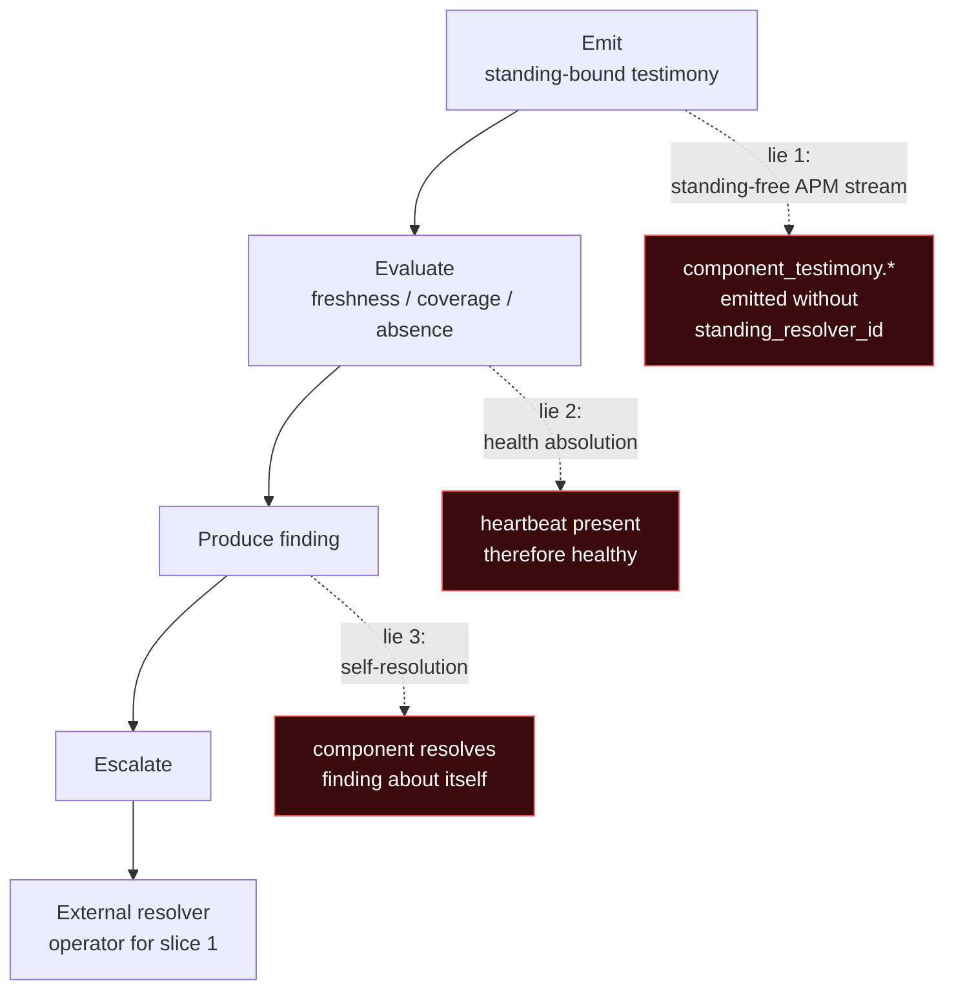

# NQ-on-NQ — Component-Testimony Foundation (Coverage + Resolver Split + First Heartbeat)

**Status:** `design-preflight` — drafted 2026-05-28 as the foundation slice for NQ-on-NQ build-forward, emit-only. No code, schema, or wire change authorized by this doc.

**Parent:** [`NQ_NS_CHANNEL_SPLIT_NQ_SIDE`](../../gaps/NQ_NS_CHANNEL_SPLIT_NQ_SIDE.md) (filed 2026-05-28; this preflight builds the missing coverage primitive named there in §3).

**Depends on:** [`NQ_SELF_SQLITE_WAL`](NQ_SELF_SQLITE_WAL.md) (Tier 0 NQ-on-NQ, shipped), [`NQ_BINARY_MTIME_STATE`](NQ_BINARY_MTIME_STATE.md) (Tier 1 design, not built), the parked [`WITNESS_IDENTITY_AND_ABSENCE_GAP`](../../gaps/WITNESS_IDENTITY_AND_ABSENCE_GAP.md) reconciliation 2026-05-28.

**Composes with:** `~/git/cartography/coordination/NQ-NS-CHANNEL-SPLIT.md` (bilateral spike), `~/git/cartography/coordination/SELF-SUBJECT-COLLAPSE.md` (shared gap — the unresolved external-reconciler problem this preflight explicitly does *not* solve).

**Last updated:** 2026-05-28.

## 0. The wager

NQ-on-NQ is the ur-example for standing-bound component testimony. Build the foundation primitives (coverage rule + four-way resolver split) and one emitter (`observation_loop_alive` heartbeat) before applying the pattern to NS, labelwatch, Governor, or any external adopter. **Emit half only.** NQ may observe its own substrate and emit; NQ may not resolve escalated findings about itself. Escalation routes to operator.

The hard things this proves before any external adopter touches the pattern:

1. **Self-observation without self-absolution.** NQ emits packets about NQ-self; the packets testify, they do not absolve.
2. **Positive testimony with explicit expiry.** Every emit carries `expires_at`; absence past expiry is meaningful only under declared coverage.
3. **Absence classified through coverage.** The seven-state absence taxonomy from the reconciled `WITNESS_IDENTITY_AND_ABSENCE_GAP` becomes operational, not theoretical.
4. **Escalation routed outward.** When an NQ-on-NQ finding needs operational resolution, the lifecycle-mutation surface structurally refuses self-resolution.
5. **Standing-bound packet shape reusable by other components.** When NS / labelwatch / Governor adopt the pattern, the shape is copy-paste with different vocabulary, not new design.

## 1. The four-way resolver split — pinned

The word "resolver" was already laundering itself. Split immediately, before any wire surface commits:

| Field | Meaning | NQ-on-NQ V0 value |
|---|---|---|
| `standing_resolver_id` | Who/what determined this emitter has standing to emit this packet class | `nq.local.static_config` (provisional, until Standing-tool integration) |
| `escalation_target` | Who may decide what the finding means operationally | **`operator` — never `nq` when the subject is NQ-self** |
| `coverage_rule_id` (+ `coverage_rule_hash`) | Which expectation made absence/expiry meaningful for this packet, AND which exact rule version produced this evaluation | Integer FK + content-hash of the rule at emit time (per §F historical-resolution discipline) |
| `evaluation_engine_id` | Which code evaluated the observation into a packet/finding | NQ binary build identifier (e.g., `nq.v0+sha:abc123`) |

**Field naming choice:** `escalation_target` is the canonical field name throughout NQ. The operator's instruction listed `escalation_target / incident_resolver_id` as synonyms; NQ standardizes on `escalation_target` to avoid synonym proliferation across the wire surface.

**Propagation (per scope question C, resolved 2026-05-28):** all four fields propagate **packets → findings → receipts**. Each layer carries the values denormalized rather than reconstructing them via foreign-key chase, so historical receipts remain interpretable even if coverage rules are later renamed/expired/deleted.

**Why include `coverage_rule_hash` alongside `coverage_rule_id`:** the integer FK identifies *which* rule was in effect; the content-hash anchors *what the rule said* at emit time. Per scope question F: when coverage rules change (append-only, new row supersedes), historical packets continue to resolve through their then-active rule. The hash on the packet is the canonical anchor — if the rule's row is later mutated or deleted, the packet's hash still names the original rule content. Re-evaluation under a different rule is a *new* evaluation/receipt, not a retroactive verdict.

The discriminator that prevents the collapse: a packet from `evaluation_engine_id = nq.v0+sha:abc123` with `standing_resolver_id = nq.local.static_config` *cannot also* serve as its own `escalation_target`. The four fields are structurally independent; the V0 code path never populates `escalation_target` from `evaluation_engine_id` or vice versa. Tests pin this independence (see §6).

**Why `nq.local.static_config` and not just `nq`:** the `standing_resolver_id` names the *mechanism* that decided standing, not the *agent* that emits. A future flip to Standing-tool integration changes only this field (`nq.local.static_config` → `standing_tool.v1:grant-abc-...`). The change is observable in receipts without rebuilding the binary.

**The bureaucratic-spontaneous-generation refusal:** the test that proves NQ is not laundering self-standing is that flipping `standing_resolver_id` to `null` MUST cause emission to refuse. Standing is not optional. A packet without a named standing resolver is not admissible at the ingestion boundary, even when the emitter is NQ itself.

## 2. The coverage-rule primitive — new table + JSON config

NQ today has `node_unobservable` (finding-shaped — produced after the fact) and per-claim-kind freshness horizons (receipt-shaped — produced at emission time). Neither is *coverage-declaration-shaped*. The first-slice heartbeat needs the missing primitive.

**Operator-surface storage (per scope question D, resolved 2026-05-28):** JSON file at runtime path `config/coverage.json` (per-aggregator, alongside `aggregator.json`). Documented example at `docs/examples/coverage.json`. **Do not embed coverage rules in `aggregator.json`** — aggregator output should report which coverage rule was active, not become the rule registry. **Do not add a CLI verb in this slice** — the JSON loader is the V0 declaration surface; a `nq coverage` CLI verb arrives later when humans need to inspect/list/validate rules.

**JSON shape (one rule per array element):**

```json
[
  {
    "component_id": "nq.local",
    "subject_id": "observation_loop",
    "claim_kind": "component_testimony_observation_loop_alive",
    "expected_interval_s": 60,
    "grace_multiplier": 2.0,
    "coverage_start": "2026-05-28T00:00:00Z",
    "valid_until": null,
    "standing_resolver_id": "nq.local.static_config",
    "escalation_target": "operator",
    "declared_by": "operator",
    "declared_at": "2026-05-28T00:00:00Z",
    "notes": "first-slice NQ-on-NQ observation-loop heartbeat"
  }
]
```

**Proposed migration (new table; not authorized to build by this doc):**

```sql
CREATE TABLE coverage_rules (
    coverage_rule_id     INTEGER PRIMARY KEY AUTOINCREMENT,
    component_id         TEXT NOT NULL,         -- "nq.local", "ns.local", future external
    subject_id           TEXT NOT NULL,         -- e.g., "observation_loop"
    claim_kind           TEXT NOT NULL,         -- "component_testimony_observation_loop_alive"
    expected_interval_s  INTEGER NOT NULL,      -- 60 for the first slice
    grace_multiplier     REAL NOT NULL DEFAULT 2.0,
    coverage_start       TEXT NOT NULL,         -- RFC3339 UTC
    valid_until          TEXT,                  -- NULL = open-ended (rare; declare explicitly)
    standing_resolver_id TEXT NOT NULL,         -- per §1 — coverage rule and emitter must agree
    escalation_target    TEXT NOT NULL,         -- per §1 — "operator" for NQ-on-NQ
    declared_by          TEXT NOT NULL,         -- provenance: operator / config-file / etc.
    declared_at          TEXT NOT NULL,
    notes                TEXT,
    coverage_rule_hash   TEXT NOT NULL,         -- SHA-256 of canonical-JSON over the rule's
                                                -- defining fields; computed at load time
    CHECK (expected_interval_s > 0),
    CHECK (grace_multiplier >= 1.0)
);

CREATE UNIQUE INDEX coverage_rules_active
    ON coverage_rules(component_id, subject_id, claim_kind)
    WHERE valid_until IS NULL OR valid_until > coverage_start;
```

**`coverage_rule_hash` computation:** SHA-256 over canonical-JSON of `(component_id, subject_id, claim_kind, expected_interval_s, grace_multiplier, standing_resolver_id, escalation_target, declared_by, declared_at, valid_until, coverage_start)`. Fields ordered alphabetically; serialization rules match the parked `WITNESS_IDENTITY_AND_ABSENCE_GAP` §1.1 packet-identity discipline. Stored on the rule row at load time AND stamped onto every emitted packet (so packets remain interpretable if rules are later mutated/deleted).

Coverage rule discipline:

- **Per-(component_id, subject_id, claim_kind) uniqueness for active rules.** Two active rules expecting the same testimony is the laundering shape this gap refuses; the unique index enforces it.
- **`valid_until` is required-by-convention for non-open-ended rules.** Open-ended coverage (`valid_until = NULL`) is allowed but loud (per the parked gap §1.5 absence-has-scope discipline; an open-ended rule is a forever-expectation and must be declared explicitly).
- **No code path may update `coverage_rules` rows in place.** A coverage rule that changes (interval bumped, grace adjusted) is a *new* row; the previous row gets `valid_until` set to the change time. Coverage history is append-only by design.
- **Coverage rule provenance is required.** `declared_by` + `declared_at` are non-optional. Anonymous coverage rules are not admissible.
- **JSON loader is the V0 declaration surface.** The aggregator re-reads `config/coverage.json` once per pulse; new rules land as new rows; existing rules' `valid_until` is set when the JSON no longer declares them. No in-place row mutation; the loader translates JSON deltas to append-only DB operations.

Absence-classification vocabulary (from the reconciled `WITNESS_IDENTITY_AND_ABSENCE_GAP` §2):

```text
CoverageUnknown      no row in coverage_rules for this (component_id, subject_id, claim_kind)
NeverObserved        coverage exists, no packet has ever arrived under it
PreviouslyObservedExpired
                     last packet's expires_at passed without renewal
SourceUnreachable    NQ cannot reach the emit channel (catch-all)
SourceRefused        emit channel reachable but actively refused
                     (MAY-split of SourceUnreachable at wire boundary)
ReportedButRefused   emit arrived but failed admissibility (standing fail,
                     schema fail, signature fail)
SourceDeclaredAbsent not applicable at heartbeat layer (no authenticated
                     denial of own existence)
```

## 3. The first emitter — `component_testimony_observation_loop_alive`

Boring, by design.

**Claim-kind naming (per scope question A, resolved 2026-05-28):** namespaced/prefixed snake_case. The full kind name is `component_testimony_observation_loop_alive`. The `component_testimony_` prefix is a **claim namespace**, not an axis declaration; it discriminates this kind family from future external-component or product-level observers (NS, Governor, Wicket, app-level) that might otherwise collide on bare names. The dot-form (`component_testimony.observation_loop_alive`) is rejected for storage/wire because:

- NQ's existing `ClaimKind` enum uses `serde(rename_all = "snake_case")` (one underscore per word, no separators).
- SQL CHECK constraints, HTTP route segments, and JSON property keys all interact awkwardly with dots.
- Snake_case namespacing preserves the discriminator without requiring custom serde renaming.

**Claim kind addition** to `ClaimKind` enum in `crates/nq-core/src/preflight.rs:62`:

```rust
pub enum ClaimKind {
    DiskState,
    IngestState,
    DnsState,
    SqliteWalState,
    ComponentTestimonyObservationLoopAlive,  // NEW — first component-testimony kind
}
```

**Substrate table** (new migration, not authorized to build):

```sql
CREATE TABLE observation_loop_alive_observations (
    observation_id        INTEGER PRIMARY KEY AUTOINCREMENT,
    generation_id         INTEGER NOT NULL,
    -- Identity / coverage matching:
    component_id          TEXT NOT NULL,         -- "nq.local"
    subject_id            TEXT NOT NULL,         -- "observation_loop"
    -- Envelope:
    observed_at           TEXT NOT NULL,         -- RFC3339 UTC
    generated_at          TEXT NOT NULL,
    expires_at            TEXT NOT NULL,         -- generated_at + interval * grace_multiplier
    -- Four-way resolver split (per §1; all four denormalized at emit time):
    standing_resolver_id  TEXT NOT NULL,
    escalation_target     TEXT NOT NULL,
    coverage_rule_id      INTEGER NOT NULL,
    coverage_rule_hash    TEXT NOT NULL,         -- content-hash of rule at emit time (per §F)
    evaluation_engine_id  TEXT NOT NULL,
    -- Bounded heartbeat diagnostic payload (per scope question E, resolved 2026-05-28):
    loop_name             TEXT NOT NULL,         -- equals subject_id in V0; reserved for multi-loop-per-subject future
    checkpoint_name       TEXT NOT NULL,         -- e.g., "pulse_complete"
    last_success_at       TEXT,                  -- RFC3339 UTC; NULL on first emit
    component_version     TEXT NOT NULL,         -- emitting code version
    schema_version        TEXT NOT NULL,         -- packet schema version
    -- Identity:
    emission_id           TEXT NOT NULL UNIQUE,
    FOREIGN KEY (generation_id) REFERENCES generations(generation_id) ON DELETE CASCADE,
    FOREIGN KEY (coverage_rule_id) REFERENCES coverage_rules(coverage_rule_id)
);
```

**Table-naming choice:** the table is named after its kind (`observation_loop_alive_observations`) per NQ's existing per-kind convention (`wal_observations`, `dns_observations`, `nq_binary_observations`-planned). The `component_testimony_` namespace prefix lives on the wire/enum surface; the substrate table omits it. Future component-testimony kinds get their own substrate tables — heartbeats are **not** a shared junk-drawer table.

**Bounded payload — the junk-drawer refusal (scope question E):** the heartbeat's payload is a closed set: `loop_name`, `checkpoint_name`, `last_success_at`, `component_version`, `schema_version`. Other potentially-relevant fields the operator's instruction named — `sqlite_db_path`, `wal_present`, `wal_size_bytes`, `last_export_status`, `export_path_available` — **do not belong in this packet**. WAL state is its own packet (`component_testimony_sqlite_wal_state`); export-path state is its own packet (`component_testimony_export_path_*`). Each kind gets its own substrate table, its own coverage rule, its own kind-level `cannot_testify`. The heartbeat says *the loop reached a checkpoint*; it does not testify to anything else. **Heartbeat is not a junk drawer.**

**First-slice coverage rule** (declared in `config/coverage.json`, not built into the schema as a default):

```json
{
  "component_id": "nq.local",
  "subject_id": "observation_loop",
  "claim_kind": "component_testimony_observation_loop_alive",
  "expected_interval_s": 60,
  "grace_multiplier": 2.0,
  "coverage_start": "<deploy timestamp>",
  "valid_until": null,
  "standing_resolver_id": "nq.local.static_config",
  "escalation_target": "operator",
  "declared_by": "operator",
  "declared_at": "<deploy timestamp>"
}
```

**First-slice emit cadence:** the `nq serve` process emits `component_testimony_observation_loop_alive` once per its observation-loop pulse (60s in default config). The emit is *internal* to the running NQ binary — NQ writes a row to `observation_loop_alive_observations` from inside its own pulse loop.

### Finding kind for coverage-resolved absence — `coverage_testimony_absent`

**Per scope question B, resolved 2026-05-28: new finding kind.** Do not overload `node_unobservable`.

```text
finding_kind = coverage_testimony_absent

Semantics:
  Under coverage rule R, testimony of kind K from component C
  was expected by time T and is absent / expired / refused /
  unreachable. The classification is one of the seven absence
  states from WITNESS_IDENTITY_AND_ABSENCE_GAP §2 (NOT
  CoverageUnknown — that state is upstream of finding creation).
```

**Why this is distinct from `node_unobservable`:**

- `node_unobservable` is host-scoped — "this host's testimony as a whole is structurally missing." Cause candidates: `agent_stopped`, `agent_unreachable`, `host_unreachable`.
- `coverage_testimony_absent` is per-`(component_id, subject_id, claim_kind)`-scoped — "this *specific* testimony class from this *specific* component is absent under this *specific* coverage rule." A node may be observable in aggregate while one expected testimony class is missing. Collapsing the two is exactly how APM mush begins.

**Storage shape — detail table, not sparse nullable columns (operator-revised 2026-05-28).** The base finding rows (`warning_state`, `finding_observations`) stay generic; coverage-specific fields live in a narrow per-kind detail table.

Naming: **`coverage_testimony_absence_details`**.

Rationale (operator + revised review):

- Most finding kinds will never use these fields. Adding them as nullable columns on `warning_state` / `finding_observations` bakes a component-testimony absence vocabulary into the generic finding substrate — that's the kind of "seemed simpler at the time" move that later becomes schema folklore.
- Before consumers exist (renderers, HTTP output, fixtures, receipts, dashboards, NS expectations growing around sparse columns) is exactly when a schema correction is cheapest. Future-you does not get to excavate sediment with a spoon.
- This is a **surgical per-kind detail table**, not a generic extension framework. The mig038 sparse-column precedent still stands for cross-kind envelope vocabulary (degradation_kind, recovery_state, etc.); it does not apply to per-kind absence vocabulary.

```text
Base table (existing):
  warning_state / finding_observations rows with
    kind = 'coverage_testimony_absent'

Detail table (new in commit 7):
  coverage_testimony_absence_details (
    finding_key            TEXT PRIMARY KEY,
    coverage_rule_id       INTEGER NOT NULL,
    coverage_rule_hash     TEXT NOT NULL,
    component_id           TEXT NOT NULL,
    subject_id             TEXT NOT NULL,
    claim_kind             TEXT NOT NULL,
    absence_state          TEXT NOT NULL,  -- six-state subset of the seven
                                           -- (never CoverageUnknown)
    expected_after         TEXT,           -- RFC3339 UTC; coverage_start when known
    expected_by            TEXT,           -- RFC3339 UTC; computed from rule
    last_observed_at       TEXT,           -- RFC3339 UTC; NULL when NeverObserved
    last_emission_id       TEXT,           -- prior emission_id, when one existed
    standing_resolver_id   TEXT NOT NULL,
    escalation_target      TEXT NOT NULL,
    evaluation_engine_id   TEXT NOT NULL,
    source_detail          TEXT,           -- optional refusal / unreachable detail
    FOREIGN KEY (finding_key) REFERENCES finding_observations(finding_key)
  )
```

The base finding records *the existence and state of the finding*; the detail table records *why this expected testimony is absent under which rule*. Clean boundary, narrow surface, no sediment in the generic finding substrate.

The four resolver-split fields propagate to the detail row at creation time (per §1's propagation discipline). A coverage rule that is later mutated/deleted does not invalidate the detail row's record of what was expected.

**Future component-testimony kinds** (e.g., `component_testimony_sqlite_wal_state`, `component_testimony_export_path_available`) each get their own per-kind detail table if their absence semantics differ from this one. If a follow-up review finds the per-kind detail-table pattern duplicating across many component-testimony kinds, file a refactor gap then — not a generic-extension-framework now.

**Finding lifecycle.** When a `coverage_testimony_absent` finding has `escalation_target = operator` (queried via the detail table) AND `subject_component_id = actor.component_id`, lifecycle transitions are refused per the §5 standing prohibition. This is what makes the slice's self-resolution refusal testable.

**The honest framing:** NQ emits standing-bound self-testimony that *the observation loop ran*. NQ does NOT emit "NQ is healthy" / "NQ is operational" / "all loops are alive." The single fact the packet testifies to: the loop ran, at this time, under this coverage rule.

**Self-witness wrinkle, named:** because the emitter and the subject are the same process, this packet's witness shape is *not* external (the SIGSTOP test from `NQ_BINARY_MTIME_STATE` §3 fails — if `nq serve` is frozen, no `observation_loop_alive` packet appears). This is by design: the packet's positive case is admissible *because* the loop running emits its own pulse; its absence is admissible only because an EXTERNAL party (the aggregator, the operator dashboard) consults `coverage_rules` and observes that the expected packet did not arrive. The witness for *absence* is external (the aggregator's coverage-resolver); the witness for *presence* is internal (the loop pulse itself). Tests pin this asymmetry.

## 4. Constitutional `cannot_testify`

The kind-level refusal list, attached to every `observation_loop_alive` packet:

```text
"Whether NQ is healthy (the observation loop running is one signal
 among many; an alive loop emitting heartbeats does not testify to
 NQ standing as a whole)"
"Whether other NQ loops (reconciler, ack, ingest, export) are alive
 (this kind testifies only to the observation loop; sibling loops
 need their own component-testimony kinds)"
"Whether NQ's stored claims are semantically correct (substrate
 observation only)"
"Whether NQ's ingested witnesses are truthful (NQ does not certify
 producer truthfulness)"
"Whether SQLite is an admissible architecture for this deployment
 (substrate-state observation does not endorse substrate-choice)"
"Whether to escalate, restart, or page (consequence claim; per the
 escalation_target field, lifecycle resolution lives outside NQ
 when the subject is NQ-self)"
"Whether absence of this testimony means NQ is unhealthy (absence
 under declared coverage is one of seven absence states; only the
 consumer routes it to escalation, NQ does not)"
"Whether NQ's future operation is safe (no future-state testimony)"
"Whether composed verdicts derived from this testimony may be
 re-emitted as claims (composition is read-side projection only;
 see NQ_NS_CHANNEL_SPLIT_NQ_SIDE §4 composition rule acceptance)"
```

## 5. Two prohibition classes — wire vs standing

This slice's refusals fall into two structurally distinct classes. Collapsing them is the failure mode the operator's 2026-05-28 refinement explicitly named.

**Class 1 — wire prohibition (no admissible channel exists).** A code path does not exist that *could* perform the action. Not a feature flag, not a runtime check that returns "forbidden," not a comment in the code that says "don't enable this." The route is structurally absent.

In this slice, the wire prohibition lands at emission admission:

```text
emit(claim_kind, payload, standing_resolver_id=NULL) → refused at type/wire boundary
```

Standing-free emission is not a refused action; it is an unrepresentable shape. The four resolver-split fields (§1) are required-by-type on the substrate row; the emitter cannot produce a row without them. There is no internal "skip-standing" path that exists-but-is-disabled. The path does not exist.

**Class 2 — standing prohibition (channel may exist, claimant lacks resolver standing).** The action's wire surface is admissible; the requesting actor's identity is what makes the request refused.

In this slice, the standing prohibition lands at lifecycle mutation:

```text
transition(finding, new_state, actor) →
    refused when (finding.subject_component_id == actor.component_id)
              AND (actor.component_id != finding.escalation_target)
```

The lifecycle-mutation API has a code path that *can* transition findings. That path exists. What is refused is the *self-loop case*: NQ requesting a transition on a finding whose subject is NQ-self, when NQ is not the declared `escalation_target` for that subject. The refusal keys on identity, not on path.

**Why the split matters.** A reader looking at the lifecycle-mutation refusal might infer "we just need a feature flag to let NQ self-resolve in production." That inference is correct for *class 2* (it's a standing decision; some future external-reconciler-as-NQ-peer might legitimately be a different `actor.component_id` and resolve a finding about another NQ instance). It would be catastrophically wrong for *class 1*: standing-free emission is not a feature flag candidate, because no actor's standing grant ever makes a standing-free emit admissible. The shape itself is not testimony.

The two classes have different futures. Class 1 prohibitions stay structural forever; the wire never carries the forbidden shape. Class 2 prohibitions stay enforced until the architecture provides a qualified external reconciler (see `SELF-SUBJECT-COLLAPSE.md`), at which point the same code path admits the same transition under a different actor identity. Confusing them produces either (a) a class-1 prohibition treated as a class-2 puzzle to be solved with a flag, or (b) a class-2 prohibition implemented with a class-1 structural-absence pattern, leaving the operator with no path to legitimate resolution.

**The composition lines.** Both prohibition classes have keepers in adjacent doctrine:

- **Class 1 (wire):** *"The cycle-closing channel does not exist."* (NS-spike, applied to standing-free emit: the shape that bypasses standing is not in the wire-acceptable type space.)
- **Class 2 (standing):** *"A subject is never allowed to be its own verifier."* (NS-spike, applied at the mutation surface.)

**Forward guardrail.** No PR may add either (a) a code path that admits a standing-free emit (class 1 violation), or (b) a code path that lets NQ transition a finding whose subject is NQ-self while the `escalation_target` is operator (class 2 violation). Tests pin both refusals (§6); the discipline lives in the code, not in review comments.

**This composes with `SELF-SUBJECT-COLLAPSE.md`:** the class-2 refusal makes the collapse *visible*. NQ emitting "the loop died" can't be resolved by NQ. Today there is no external reconciler available in the architecture beyond the operator-as-eyeballs. The shared gap explicitly defers solving this; this slice ratifies the refusal half (the wire and standing prohibitions, both structural) and leaves the resolution-path-creation work to the shared gap.

> **The forbidden edges are not implementation TODOs. They are the doctrine. They are drawn so future implementers can see which tempting shortcuts must not exist.**

## 6. Acceptance criteria

The acceptance shape is structured around three forbidden lies. Each test below maps to refusing one of the lies; an implementation that passes all the tests has, by construction, refused all three.



Lie 1 (standing-free APM stream) is the **wire prohibition** from §5: standing-free emission is unrepresentable. Lie 3 (self-resolution) is the **standing prohibition** from §5: the lifecycle-mutation path refuses self-loops. Lie 2 (health absolution) is the semantic lie that sits *between* them: the renderer / evaluator / consumer must not compose `heartbeat present → component healthy`. That lie is refused by the kind-level `cannot_testify` list (§4) and by the composition rule from `NQ_NS_CHANNEL_SPLIT_NQ_SIDE` §4 (composition is read-side projection only, never re-emittable as a claim).

When the implementation slice ships, the following must hold:

1. **Coverage rule lifecycle.** A coverage rule can be declared via `config/coverage.json`, loaded into the `coverage_rules` table, and superseded by editing the JSON (new row created; previous row's `valid_until` set). `valid_until` enforcement is correct at the index level; two active rules for the same `(component, subject, kind)` tuple are rejected.
2. **Coverage rule hash stability.** `coverage_rule_hash` is deterministic over canonical-JSON serialization of the rule's defining fields. Identical rule content produces identical hashes; any field change produces a different hash.
3. **Standing-bound emit.** `nq serve` emits one `component_testimony_observation_loop_alive` row per pulse with all four resolver-split fields populated (including `coverage_rule_hash` denormalized from the rule). An emit attempt with `standing_resolver_id = NULL` or `coverage_rule_id = NULL` is refused at the type/wire boundary; the row cannot be constructed.
4. **Bounded payload.** Heartbeat carries exactly the declared diagnostic columns (`loop_name`, `checkpoint_name`, `last_success_at`, `component_version`, `schema_version`). No WAL/disk/export fields; the substrate table's schema does not permit them.
5. **Expiry computation.** `expires_at` = `generated_at + (interval * grace_multiplier)`, computed at emit time, never recomputed downstream.
6. **Absence classification.** Given a coverage rule and the current time, the absence resolver returns one of the seven states from `WITNESS_IDENTITY_AND_ABSENCE_GAP` §2.
7. **`CoverageUnknown` default.** Querying absence for a `(component, subject, claim_kind)` triple with no active coverage rule returns `CoverageUnknown`, **not** `NeverObserved`. (This is what prevents the "NQ heartbeat missing → NQ unhealthy without coverage" laundering.)
8. **Historical resolution (per §F).** A packet emitted under rule version `R1` (hash `H1`) continues to resolve through `R1` even after the rule is superseded by `R2` (hash `H2`). Re-evaluation under `R2` produces a new evaluation/receipt; the original receipt is not retroactively mutated.
9. **New finding kind with detail table.** Absence resolving to any of the six finding-producing states (i.e., not `CoverageUnknown`) produces a `coverage_testimony_absent` finding distinct from `node_unobservable`. The base finding row stays generic; coverage-specific fields (absence_state, coverage_rule_id, coverage_rule_hash, four resolver-split fields, expected_by, last_observed_at, etc.) live in the `coverage_testimony_absence_details` per-kind detail table joined by `finding_key`. The base substrate is not contaminated with kind-specific vocabulary.
10. **Lifecycle refusal — structural (Lie 3 refused).** A test case attempts to transition a `coverage_testimony_absent` finding via NQ's own lifecycle path; the transition is refused with a clear error naming `escalation_target`. The refusal is at the surface layer, not a feature flag.
11. **Lifecycle refusal — escape.** The operator-shell CLI path can transition the finding because the requesting actor is `operator`, not `nq.local`. The refusal is keyed on actor identity, not on path.
12. **Resolver-split independence.** Tests verify the four resolver-split fields are structurally independent — populating one does not implicitly populate another. A packet with `standing_resolver_id` set but `escalation_target` missing fails the row-construction step (not a runtime check).
13. **Wire refusal (Lie 1 refused).** No code path exists by which a row may be inserted into `observation_loop_alive_observations` with any resolver-split field NULL/missing. The discipline is type/wire-level, demonstrable by the absence of a code path that attempts it.
14. **HTTP route for the new kind.** `GET /api/preflight/component-testimony-observation-loop-alive?component=nq.local&subject=observation_loop` returns a well-formed `nq.preflight.component_testimony_observation_loop_alive.v1` PreflightResult carrying all four resolver-split fields.
15. **Receipt-side propagation.** The PreflightResult and downstream receipt both carry `standing_resolver_id`, `escalation_target`, `coverage_rule_id`, `coverage_rule_hash`, and `evaluation_engine_id` as first-class fields. Renderers surface them (see render-side discipline from the freshness/provenance parity work shipped 2026-05-28).

## 7. Implementation slicing — ONE authorized slice

**Operator authorization (2026-05-28):** the six scope questions (§9) resolved; this slice is authorized to proceed. **One slice, not two.** The operator's spec covers foundation + first emitter + finding + receipt + tests in a single coherent landing.

The slice's checklist, in operator-given order:

1. **`config/coverage.json`** with one rule: expect `component_testimony_observation_loop_alive` from `nq.local`, subject `observation_loop`, interval 60s, grace_multiplier 2.0 (expires_at = generated_at + 120s), `escalation_target = operator`.
2. **Migrations:** `coverage_rules` table (per §2) + `observation_loop_alive_observations` table (per §3) + `coverage_testimony_absence_details` per-kind detail table (per §3's finding subsection; operator-revised 2026-05-28 — NOT sparse nullable columns on `warning_state` / `finding_observations`). The base finding rows stay generic; coverage-specific fields live in the narrow detail table.
3. **Coverage-rule loader:** read `config/coverage.json` on aggregator startup and once per pulse; compute `coverage_rule_hash` over canonical-JSON of defining fields; reconcile JSON declarations to DB rows via append-only operations.
4. **Standing-bound heartbeat emit:** `nq serve` writes one `observation_loop_alive_observations` row per observation-loop pulse, with all four resolver-split fields denormalized from the active coverage rule. Row construction refuses NULL on any required field.
5. **`ClaimKind::ComponentTestimonyObservationLoopAlive`** variant added to the enum; `as_str()` returns `"component_testimony_observation_loop_alive"`.
6. **Absence resolver:** `(component_id, subject_id, claim_kind, now) → AbsenceState` returning one of seven states (`CoverageUnknown` when no active rule).
7. **Finding production:** when absence resolves to anything other than `CoverageUnknown`, produce a `coverage_testimony_absent` finding row with all four resolver-split fields denormalized + `absence_state` + `last_observed_at` + `expected_by`.
8. **Lifecycle refusal:** the finding-transition path (CLI or HTTP — both surfaces) refuses `(subject_component == actor.component_id) AND (actor != escalation_target)`. Tests prove NQ can NOT mark a `coverage_testimony_absent` self-finding resolved when acting as `nq.local`.
9. **HTTP route:** `GET /api/preflight/component-testimony-observation-loop-alive?component=...&subject=...` returns the typed PreflightResult carrying all four resolver-split fields.
10. **Receipt-side propagation:** all four resolver-split fields land on receipts emitted from the new evaluator; renderers (per the 2026-05-28 metadata-parity work) surface them.
11. **Tests:** seven absence states (including `CoverageUnknown` default), wire refusal (Lie 1), composition refusal via `cannot_testify` (Lie 2), self-resolution refusal (Lie 3), historical-resolution discipline (§F: packet emitted under rule R1 resolves through R1 after R2 supersedes).

**Explicitly out-of-scope-for-this-slice (operator-pinned):**

- No generic APM hook bus.
- No dashboard.
- No NS integration.
- No self-resolution (the refusal is the artifact; resolution architecture lives in `SELF-SUBJECT-COLLAPSE`).
- No `health.ok` shape, in any encoding.
- No additional component-testimony kinds (no `component_testimony_sqlite_wal_state`, no `component_testimony_export_path_*` in this slice — each gets its own preflight/slice when needed).
- No CLI verb for coverage-rule management (`nq coverage list` etc. arrive later when humans need it; JSON file is the V0 declaration surface).
- No bare heartbeat without diagnostic payload (Lie 2 mitigation; the heartbeat is structured testimony, not a presence flag).

**Suggested commit splits (archaeology-story-oriented):**

The slice is large enough to merit careful commit splits. Proposed:

```
1. feat: add coverage_rules primitive (migration + table + hash discipline)
2. feat: add coverage_rules JSON loader (config/coverage.json)
3. feat: add ClaimKind::ComponentTestimonyObservationLoopAlive variant
4. feat: add observation_loop_alive_observations substrate table + row constructor
5. feat: wire heartbeat emit into nq-serve observation-loop pulse
6. feat: add absence resolver returning seven-state taxonomy
7. feat: add coverage_testimony_absent finding kind (migration + producer)
8. feat: enforce self-resolution refusal at lifecycle-mutation surface
9. feat: add /api/preflight/component-testimony-observation-loop-alive route
10. feat: propagate four resolver-split fields onto receipts + render parity
11. test: pin the three lies — wire refusal, composition refusal, self-resolution refusal
12. test: pin historical-resolution discipline (rule R1 vs R2)
```

Twelve commits is the upper bound; some can sensibly merge (e.g., 1+2, 3+4, 7+8). The operator's call on tighter grouping comes at commit time, per `[[feedback_archaeology_commits]]`.

## 8. What this slice does NOT do

- **Does not solve `SELF-SUBJECT-COLLAPSE`.** The structural refusal is the easy half; the architectural answer to "what external reconciler resolves an NQ-on-NQ escalated finding" is deferred to the shared gap.
- **Does not authorize a generic workload-phase witness contract.** The held `docs/integration/WORKLOAD_PHASE_WITNESSES.md` draft remains held; this slice does not promote it.
- **Does not add additional component-testimony kinds.** `component_testimony_sqlite_wal_state`, `component_testimony_export_path_available` / `component_testimony_export_path_degraded`, `component_testimony_coverage_rule_active` from the operator's instruction are *named* as follow-up slices, not built. Each subsequent kind gets its own design preflight; this preflight ratifies the foundation + first heartbeat only.
- **Does not integrate the Standing tool.** `standing_resolver_id = nq.local.static_config` is the V0 mechanism; the `StandingResolver` seam from `REMOTE_SURFACE_AUTH_AND_STANDING_GAP` is the deferred integration target. The Phase-4 tripwire (`project_standing_phase4_gate`) is consulted but not flipped.
- **Does not address NS-side wiring.** This is NQ-on-NQ first. NS-side adoption follows after the foundation lands and NS-Claude files the symmetric NS-side gap.
- **Does not extend axis-aware shape to receipts.** Receipts carry `claim_kind` as before; "axis" is encoded in the kind's name + cannot_testify list, not in a separate field. If axis emerges as a separable primitive, that's a follow-up slice.
- **Does not authorize labelwatch / driftwatch / Governor / gov-webui adoption.** Those are downstream of this slice landing and the NS-side symmetric gap ratifying the pattern.

## 9. Scope questions — RESOLVED 2026-05-28

The operator answered all six. Each entry preserves the original question for audit and adds **RESOLVED:** with the operator's directive verbatim.

**A. Claim-kind naming.** Flat (`observation_loop_alive`) vs prefixed (`component_testimony_observation_loop_alive`)?
- **RESOLVED: Prefixed snake_case.** Full kind name is `component_testimony_observation_loop_alive`. The `component_testimony_` prefix is a **claim namespace**, not an axis declaration. Bare names will collide later with NS / Governor / Wicket / app-level observers. Namespacing is cheap; future archaeology is not. (Snake_case rather than dot-form because of serde / SQL / HTTP convention; substantive answer matches the operator's instruction's snake_case fallback.) See §3.

**B. Finding-kind for absence-resolved-to-escalation.** New finding kind or extend `node_unobservable`?
- **RESOLVED: New finding kind, `coverage_testimony_absent`.** Do not overload `node_unobservable`. A node may be observable while one expected testimony class is absent; collapsing the two is exactly how APM mush begins. The finding's semantics are explicitly per-`(component_id, subject_id, claim_kind)` and tied to coverage rule. See §3 finding-kind subsection.

**C. Resolver-split field propagation.** Do all four fields propagate packets → findings → receipts?
- **RESOLVED: Yes — all four propagate, with `coverage_rule_hash` alongside `coverage_rule_id`.** NQ uses `escalation_target` consistently (operator listed `incident_resolver_id` as a synonym; NQ standardizes on `escalation_target`). For NQ-on-NQ first slice: `standing_resolver_id = nq.local.static_config`, `escalation_target = operator`, `coverage_rule_id` + `coverage_rule_hash` per the loaded rule, `evaluation_engine_id` = NQ binary build id. **NQ must not be its own incident resolver.** See §1.

**D. Coverage-rule storage at the operator surface.** `aggregator.json`? CLI verb? Separate JSON file?
- **RESOLVED: Runtime JSON file at `config/coverage.json`; documented example at `docs/examples/coverage.json`.** **Do not embed in `aggregator.json`** — aggregator output should report which rule was active, not become the rule registry. **Do not add a CLI verb in this slice.** CLI arrives later when humans need to inspect/list/validate rules. The loader translates JSON deltas to append-only DB operations. See §2.

**E. First emit's payload.** Bare heartbeat vs diagnostic enrichment?
- **RESOLVED: Bounded diagnostic enrichment.** Not bare (bare becomes `health.ok` with a fake mustache); not a junk drawer (WAL/disk/export fields belong to other component-testimony kinds, not this one). Payload columns: `loop_name`, `checkpoint_name`, `last_success_at`, `component_version`, `schema_version`. Operator-listed *optional* fields (`sqlite_db_path`, `wal_present`, `wal_size_bytes`, `last_export_status`, `export_path_available`) are explicitly **NOT** included — each is a separate component-testimony kind in a separate slice. **Heartbeat is not a junk drawer.** See §3.

**F. Coverage-rule expiry on `valid_until`.** Historical packets resolve through then-active rule, or retro-classify?
- **RESOLVED: Historical packets resolve through their then-active rule.** Do not retro-classify old packets under new coverage rules. Packets carry `coverage_rule_id` AND `coverage_rule_hash`; evaluation uses the rule active at `evaluated_at`; later rule changes do not rewrite prior verdicts; re-evaluation under a new rule is a new evaluation/receipt, not a mutation of the old one. This preserves receipt meaning and avoids time-travel compliance. See §1 (hash propagation) and §6 acceptance #8.

**Implementation slice authorized to proceed** (per §7) once these answers are encoded above. They are encoded above.

## 10. Forcing case (what made this imminent)

The operator's build-forward instruction 2026-05-28, sharpening the cartography NS-spike. Three composing pressures:

1. **NS-spike asked for NQ-side positions on a heartbeat-shaped first slice.** The slice cannot land without a coverage primitive.
2. **The integration-doc held in working tree** explicitly named the missing primitive but tried to ship a generic workload-phase grammar; this preflight extracts the NQ-specific foundation work and leaves the generic-grammar question parked.
3. **Self-subject-collapse named as a cross-component gap.** The shared gap requires the local refusal to be structural (not a flag); this preflight is where NQ's local refusal lands as testable code.

## 11. Cross-references

- [`NQ_NS_CHANNEL_SPLIT_NQ_SIDE`](../../gaps/NQ_NS_CHANNEL_SPLIT_NQ_SIDE.md) — the gap that named the coverage primitive as missing; this preflight is the design that delivers it.
- [`WITNESS_IDENTITY_AND_ABSENCE_GAP`](../../gaps/WITNESS_IDENTITY_AND_ABSENCE_GAP.md) — reconciled 2026-05-28 with the NS-spike taxonomy; the absence states this preflight uses are sourced there.
- [`NQ_SELF_SQLITE_WAL`](NQ_SELF_SQLITE_WAL.md) — Tier 0 NQ-on-NQ; precedent for the external-witness discipline.
- [`NQ_BINARY_MTIME_STATE`](NQ_BINARY_MTIME_STATE.md) — Tier 1 NQ-on-NQ; design-preflight format inherited.
- [`REMOTE_SURFACE_AUTH_AND_STANDING_GAP`](../../gaps/REMOTE_SURFACE_AUTH_AND_STANDING_GAP.md) — `StandingResolver` seam; the V0 `nq.local.static_config` is the placeholder until that integration ships.
- [`FINDING_LIFECYCLE_MUTATION_SURFACE_GAP`](../../gaps/FINDING_LIFECYCLE_MUTATION_SURFACE_GAP.md) — lifecycle-mutation discipline; §5 of this preflight is the structural-refusal half.
- `~/git/cartography/coordination/NQ-NS-CHANNEL-SPLIT.md` — bilateral spike this preflight composes against.
- `~/git/cartography/coordination/SELF-SUBJECT-COLLAPSE.md` — shared gap; §5 ratifies the refusal half and explicitly defers the architectural resolution.
- [[project_nq_on_nq_second_consumer]] — sixth-keeper context; this slice exercises (does not yet ratify) the keeper.
- [[project_standing_phase4_gate]] — tripwire consulted; `nq.local.static_config` is the `visible_not_binding` mode that does not yet trip the gate.

## 12. Provenance

Filed 2026-05-28 from the operator's build-forward instruction same-session as the channel-split gap and self-subject-collapse shared gap landed. The operator's framing:

> *"Make NQ-on-NQ the reference implementation for standing-bound component testimony. This is the ur-example before NS-on-NS, labelwatch hooks, Governor hooks, etc. Do not build self-resolution. NQ may observe its own substrate and emit standing-bound packets. NQ may not resolve escalated findings about itself. Escalation routes to operator as the first-slice external resolver."*

The four-way resolver-split sharpening came from the operator's recognition that "resolver" was already trying to launder itself — `standing_resolver_id` vs `incident_resolver_id` vs `coverage_rule_id` vs `evaluation_engine_id` are four different things that the V0 wire shape must not collapse. Pinning the split in the preflight (before code) is the cheaper place to do it.

The keeper that operationalizes the design:

> **NQ may emit and evaluate self-observation packets. NQ may not be the incident resolver for escalated NQ-on-NQ findings. First-slice resolver is `operator`.**

## 13. Closing line

> The foundation slice teaches NQ to emit standing-bound testimony about itself and to recognize when its own testimony is missing — without ever letting NQ be the party that decides what missing testimony *means*. The collapse stays visible. The architectural answer to the collapse is the shared gap's territory; this preflight's territory is the testable refusal that makes the collapse impossible to paper over.
