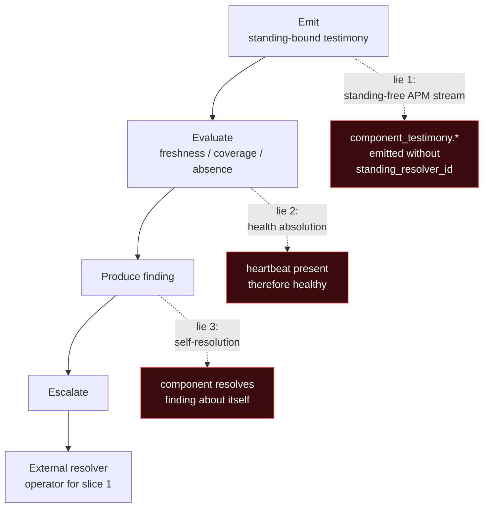

# NQ-on-NQ — Component-Testimony Foundation (Coverage + Resolver Split + First Heartbeat)

**Status:** `design-preflight` — drafted 2026-05-28 as the foundation slice for NQ-on-NQ build-forward, emit-only. No code, schema, or wire change authorized by this doc.

**Parent:** [`NQ_NS_CHANNEL_SPLIT_NQ_SIDE`](../../gaps/NQ_NS_CHANNEL_SPLIT_NQ_SIDE.md) (filed 2026-05-28; this preflight builds the missing coverage primitive named there in §3).

**Depends on:** [`NQ_SELF_SQLITE_WAL`](NQ_SELF_SQLITE_WAL.md) (Tier 0 NQ-on-NQ, shipped), [`NQ_BINARY_MTIME_STATE`](NQ_BINARY_MTIME_STATE.md) (Tier 1 design, not built), the parked [`WITNESS_IDENTITY_AND_ABSENCE_GAP`](../../gaps/WITNESS_IDENTITY_AND_ABSENCE_GAP.md) reconciliation 2026-05-28.

**Composes with:** `~/git/cartography/coordination/NQ-NS-CHANNEL-SPLIT.md` (bilateral spike), `~/git/cartography/coordination/SELF-SUBJECT-COLLAPSE.md` (shared gap — the unresolved external-reconciler problem this preflight explicitly does *not* solve).

**Last updated:** 2026-05-28.

## 0. The wager

NQ-on-NQ is the ur-example for standing-bound component testimony. Build the foundation primitives (coverage rule + four-way resolver split) and one emitter (`observation_loop_alive` heartbeat) before applying the pattern to NS, labelwatch, Governor, or any external adopter. **Emit half only.** NQ may observe its own substrate and emit; NQ may not resolve escalated findings about itself. Escalation routes to operator.

The hard things this proves before any external adopter touches the pattern:

1. **Self-observation without self-absolution.** NQ emits packets about NQ-self; the packets testify, they do not absolve.
2. **Positive testimony with explicit expiry.** Every emit carries `expires_at`; absence past expiry is meaningful only under declared coverage.
3. **Absence classified through coverage.** The seven-state absence taxonomy from the reconciled `WITNESS_IDENTITY_AND_ABSENCE_GAP` becomes operational, not theoretical.
4. **Escalation routed outward.** When an NQ-on-NQ finding needs operational resolution, the lifecycle-mutation surface structurally refuses self-resolution.
5. **Standing-bound packet shape reusable by other components.** When NS / labelwatch / Governor adopt the pattern, the shape is copy-paste with different vocabulary, not new design.

## 1. The four-way resolver split — pinned

The word "resolver" was already laundering itself. Split immediately, before any wire surface commits:

| Field | Meaning | NQ-on-NQ V0 value |
|---|---|---|
| `standing_resolver_id` | Who/what determined this emitter has standing to emit this packet class | `nq.local.static_config` (provisional, until Standing-tool integration) |
| `escalation_target` / `incident_resolver_id` | Who may decide what the finding means operationally | **`operator` — never `nq` when the subject is NQ-self** |
| `coverage_rule_id` | Which expectation made absence/expiry meaningful for this packet | Foreign key into `coverage_rules` (V0 stamp by integer id; opaque to consumers) |
| `evaluation_engine_id` | Which code evaluated the observation into a packet/finding | NQ binary build identifier (e.g., `nq.v0+sha:abc123`) |

The discriminator that prevents the collapse: a packet from `evaluation_engine_id = nq.v0+sha:abc123` with `standing_resolver_id = nq.local.static_config` *cannot also* serve as its own `escalation_target`. The four fields are structurally independent; the V0 code path never populates `escalation_target` from `evaluation_engine_id` or vice versa. Tests pin this independence (see §6).

**Why `nq.local.static_config` and not just `nq`:** the `standing_resolver_id` names the *mechanism* that decided standing, not the *agent* that emits. A future flip to Standing-tool integration changes only this field (`nq.local.static_config` → `standing_tool.v1:grant-abc-...`). The change is observable in receipts without rebuilding the binary.

**The bureaucratic-spontaneous-generation refusal:** the test that proves NQ is not laundering self-standing is that flipping `standing_resolver_id` to `null` MUST cause emission to refuse. Standing is not optional. A packet without a named standing resolver is not admissible at the ingestion boundary, even when the emitter is NQ itself.

## 2. The coverage-rule primitive — new table

NQ today has `node_unobservable` (finding-shaped — produced after the fact) and per-claim-kind freshness horizons (receipt-shaped — produced at emission time). Neither is *coverage-declaration-shaped*. The first-slice heartbeat needs the missing primitive.

Proposed migration (new table; not authorized to build by this doc):

```sql
CREATE TABLE coverage_rules (
    coverage_rule_id     INTEGER PRIMARY KEY AUTOINCREMENT,
    component_id         TEXT NOT NULL,         -- "nq.local", "ns.local", future external
    subject_id           TEXT NOT NULL,         -- e.g., "observation_loop"
    claim_kind           TEXT NOT NULL,         -- "observation_loop_alive"
    expected_interval_s  INTEGER NOT NULL,      -- 60 for the first slice
    grace_multiplier     REAL NOT NULL DEFAULT 2.0,
    coverage_start       TEXT NOT NULL,         -- RFC3339 UTC
    valid_until          TEXT,                  -- NULL = open-ended (rare; declare explicitly)
    standing_resolver_id TEXT NOT NULL,         -- per §1 — coverage rule and emitter must agree
    escalation_target    TEXT NOT NULL,         -- per §1 — "operator" for NQ-on-NQ
    declared_by          TEXT NOT NULL,         -- provenance: operator / config-file / etc.
    declared_at          TEXT NOT NULL,
    notes                TEXT,
    CHECK (expected_interval_s > 0),
    CHECK (grace_multiplier >= 1.0)
);

CREATE UNIQUE INDEX coverage_rules_active
    ON coverage_rules(component_id, subject_id, claim_kind)
    WHERE valid_until IS NULL OR valid_until > coverage_start;
```

Coverage rule discipline:

- **Per-(component_id, subject_id, claim_kind) uniqueness for active rules.** Two active rules expecting the same testimony is the laundering shape this gap refuses; the unique index enforces it.
- **`valid_until` is required-by-convention for non-open-ended rules.** Open-ended coverage (`valid_until = NULL`) is allowed but loud (per the parked gap §1.5 absence-has-scope discipline; an open-ended rule is a forever-expectation and must be declared explicitly).
- **No code path may update `coverage_rules` rows in place.** A coverage rule that changes (interval bumped, grace adjusted) is a *new* row; the previous row gets `valid_until` set to the change time. Coverage history is append-only by design.
- **Coverage rule provenance is required.** `declared_by` + `declared_at` are non-optional. Anonymous coverage rules are not admissible.

Absence-classification vocabulary (from the reconciled `WITNESS_IDENTITY_AND_ABSENCE_GAP` §2):

```text
CoverageUnknown      no row in coverage_rules for this (component_id, subject_id, claim_kind)
NeverObserved        coverage exists, no packet has ever arrived under it
PreviouslyObservedExpired
                     last packet's expires_at passed without renewal
SourceUnreachable    NQ cannot reach the emit channel (catch-all)
SourceRefused        emit channel reachable but actively refused
                     (MAY-split of SourceUnreachable at wire boundary)
ReportedButRefused   emit arrived but failed admissibility (standing fail,
                     schema fail, signature fail)
SourceDeclaredAbsent not applicable at heartbeat layer (no authenticated
                     denial of own existence)
```

## 3. The first emitter — `observation_loop_alive`

Boring, by design.

**Claim kind addition** to `ClaimKind` enum in `crates/nq-core/src/preflight.rs:62`:

```rust
pub enum ClaimKind {
    DiskState,
    IngestState,
    DnsState,
    SqliteWalState,
    ObservationLoopAlive,  // NEW — first component-testimony kind
}
```

**Scope question A (deferred to operator):** should the new kind name encode the "component-testimony axis" explicitly (e.g., `ComponentTestimonyObservationLoopAlive`) or stay flat (`ObservationLoopAlive`)? Lean: flat. NQ doesn't have axis primitives today; encoding axis in the name is `feedback_name_broadly_build_narrowly`'s "name the kind, build the slice." When a second component-testimony kind ships, the family question fires.

**Substrate table** (new migration, not authorized to build):

```sql
CREATE TABLE component_testimony_observations (
    observation_id        INTEGER PRIMARY KEY AUTOINCREMENT,
    generation_id         INTEGER NOT NULL,
    component_id          TEXT NOT NULL,
    subject_id            TEXT NOT NULL,
    claim_kind            TEXT NOT NULL,
    observed_at           TEXT NOT NULL,         -- RFC3339 UTC
    generated_at          TEXT NOT NULL,
    expires_at            TEXT NOT NULL,         -- generated_at + interval * grace_multiplier
    coverage_rule_id      INTEGER NOT NULL,      -- FK to coverage_rules; emit refuses without it
    standing_resolver_id  TEXT NOT NULL,         -- per §1
    evaluation_engine_id  TEXT NOT NULL,         -- per §1
    emission_id           TEXT NOT NULL UNIQUE,  -- per-emit identifier
    payload               TEXT,                  -- JSON; per-kind body (NULL for bare heartbeat)
    FOREIGN KEY (generation_id) REFERENCES generations(generation_id) ON DELETE CASCADE,
    FOREIGN KEY (coverage_rule_id) REFERENCES coverage_rules(coverage_rule_id)
);
```

**First-slice coverage rule** (declared at startup, not built into the schema as a default):

```text
component_id         = nq.local
subject_id           = observation_loop
claim_kind           = observation_loop_alive
expected_interval_s  = 60
grace_multiplier     = 2.0
standing_resolver_id = nq.local.static_config
escalation_target    = operator
declared_by          = operator (default config) or operator-explicit
```

**First-slice emit cadence:** the `nq serve` process emits `observation_loop_alive` once per its observation-loop pulse (60s in default config). The emit is *internal* to the running NQ binary — NQ writes a row to `component_testimony_observations` from inside its own pulse loop.

**The honest framing:** NQ emits standing-bound self-testimony that *the observation loop ran*. NQ does NOT emit "NQ is healthy" / "NQ is operational" / "all loops are alive." The single fact the packet testifies to: the loop ran, at this time, under this coverage rule.

**Self-witness wrinkle, named:** because the emitter and the subject are the same process, this packet's witness shape is *not* external (the SIGSTOP test from `NQ_BINARY_MTIME_STATE` §3 fails — if `nq serve` is frozen, no `observation_loop_alive` packet appears). This is by design: the packet's positive case is admissible *because* the loop running emits its own pulse; its absence is admissible only because an EXTERNAL party (the aggregator, the operator dashboard) consults `coverage_rules` and observes that the expected packet did not arrive. The witness for *absence* is external (the aggregator's coverage-resolver); the witness for *presence* is internal (the loop pulse itself). Tests pin this asymmetry.

## 4. Constitutional `cannot_testify`

The kind-level refusal list, attached to every `observation_loop_alive` packet:

```text
"Whether NQ is healthy (the observation loop running is one signal
 among many; an alive loop emitting heartbeats does not testify to
 NQ standing as a whole)"
"Whether other NQ loops (reconciler, ack, ingest, export) are alive
 (this kind testifies only to the observation loop; sibling loops
 need their own component-testimony kinds)"
"Whether NQ's stored claims are semantically correct (substrate
 observation only)"
"Whether NQ's ingested witnesses are truthful (NQ does not certify
 producer truthfulness)"
"Whether SQLite is an admissible architecture for this deployment
 (substrate-state observation does not endorse substrate-choice)"
"Whether to escalate, restart, or page (consequence claim; per the
 escalation_target field, lifecycle resolution lives outside NQ
 when the subject is NQ-self)"
"Whether absence of this testimony means NQ is unhealthy (absence
 under declared coverage is one of seven absence states; only the
 consumer routes it to escalation, NQ does not)"
"Whether NQ's future operation is safe (no future-state testimony)"
"Whether composed verdicts derived from this testimony may be
 re-emitted as claims (composition is read-side projection only;
 see NQ_NS_CHANNEL_SPLIT_NQ_SIDE §4 composition rule acceptance)"
```

## 5. Two prohibition classes — wire vs standing

This slice's refusals fall into two structurally distinct classes. Collapsing them is the failure mode the operator's 2026-05-28 refinement explicitly named.

**Class 1 — wire prohibition (no admissible channel exists).** A code path does not exist that *could* perform the action. Not a feature flag, not a runtime check that returns "forbidden," not a comment in the code that says "don't enable this." The route is structurally absent.

In this slice, the wire prohibition lands at emission admission:

```text
emit(claim_kind, payload, standing_resolver_id=NULL) → refused at type/wire boundary
```

Standing-free emission is not a refused action; it is an unrepresentable shape. The four resolver-split fields (§1) are required-by-type on the substrate row; the emitter cannot produce a row without them. There is no internal "skip-standing" path that exists-but-is-disabled. The path does not exist.

**Class 2 — standing prohibition (channel may exist, claimant lacks resolver standing).** The action's wire surface is admissible; the requesting actor's identity is what makes the request refused.

In this slice, the standing prohibition lands at lifecycle mutation:

```text
transition(finding, new_state, actor) →
    refused when (finding.subject_component_id == actor.component_id)
              AND (actor.component_id != finding.escalation_target)
```

The lifecycle-mutation API has a code path that *can* transition findings. That path exists. What is refused is the *self-loop case*: NQ requesting a transition on a finding whose subject is NQ-self, when NQ is not the declared `escalation_target` for that subject. The refusal keys on identity, not on path.

**Why the split matters.** A reader looking at the lifecycle-mutation refusal might infer "we just need a feature flag to let NQ self-resolve in production." That inference is correct for *class 2* (it's a standing decision; some future external-reconciler-as-NQ-peer might legitimately be a different `actor.component_id` and resolve a finding about another NQ instance). It would be catastrophically wrong for *class 1*: standing-free emission is not a feature flag candidate, because no actor's standing grant ever makes a standing-free emit admissible. The shape itself is not testimony.

The two classes have different futures. Class 1 prohibitions stay structural forever; the wire never carries the forbidden shape. Class 2 prohibitions stay enforced until the architecture provides a qualified external reconciler (see `SELF-SUBJECT-COLLAPSE.md`), at which point the same code path admits the same transition under a different actor identity. Confusing them produces either (a) a class-1 prohibition treated as a class-2 puzzle to be solved with a flag, or (b) a class-2 prohibition implemented with a class-1 structural-absence pattern, leaving the operator with no path to legitimate resolution.

**The composition lines.** Both prohibition classes have keepers in adjacent doctrine:

- **Class 1 (wire):** *"The cycle-closing channel does not exist."* (NS-spike, applied to standing-free emit: the shape that bypasses standing is not in the wire-acceptable type space.)
- **Class 2 (standing):** *"A subject is never allowed to be its own verifier."* (NS-spike, applied at the mutation surface.)

**Forward guardrail.** No PR may add either (a) a code path that admits a standing-free emit (class 1 violation), or (b) a code path that lets NQ transition a finding whose subject is NQ-self while the `escalation_target` is operator (class 2 violation). Tests pin both refusals (§6); the discipline lives in the code, not in review comments.

**This composes with `SELF-SUBJECT-COLLAPSE.md`:** the class-2 refusal makes the collapse *visible*. NQ emitting "the loop died" can't be resolved by NQ. Today there is no external reconciler available in the architecture beyond the operator-as-eyeballs. The shared gap explicitly defers solving this; this slice ratifies the refusal half (the wire and standing prohibitions, both structural) and leaves the resolution-path-creation work to the shared gap.

> **The forbidden edges are not implementation TODOs. They are the doctrine. They are drawn so future implementers can see which tempting shortcuts must not exist.**

## 6. Acceptance criteria

The acceptance shape is structured around three forbidden lies. Each test below maps to refusing one of the lies; an implementation that passes all the tests has, by construction, refused all three.



Lie 1 (standing-free APM stream) is the **wire prohibition** from §5: standing-free emission is unrepresentable. Lie 3 (self-resolution) is the **standing prohibition** from §5: the lifecycle-mutation path refuses self-loops. Lie 2 (health absolution) is the semantic lie that sits *between* them: the renderer / evaluator / consumer must not compose `heartbeat present → component healthy`. That lie is refused by the kind-level `cannot_testify` list (§4) and by the composition rule from `NQ_NS_CHANNEL_SPLIT_NQ_SIDE` §4 (composition is read-side projection only, never re-emittable as a claim).

When the implementation slice(s) below ship, the following must hold:

1. **Coverage rule lifecycle.** A coverage rule can be declared, retrieved, and (via new-row mechanism) superseded. `valid_until` enforcement is correct at the index level; two active rules for the same (component, subject, kind) tuple are rejected.
2. **Standing-bound emit.** `nq serve` emits one `observation_loop_alive` row per pulse with all four resolver-split fields populated. An emit attempt with `standing_resolver_id = NULL` is refused.
3. **Expiry computation.** `expires_at` = `generated_at + (interval * grace_multiplier)`, computed at emit time, never recomputed downstream.
4. **Absence classification.** Given a coverage rule and the current time, the absence resolver returns one of the seven states from `WITNESS_IDENTITY_AND_ABSENCE_GAP` §2.
5. **`CoverageUnknown` default.** Querying absence for a `(component, subject, claim_kind)` triple with no active coverage rule returns `CoverageUnknown`, not `NeverObserved`. (This is what prevents the "NQ heartbeat missing → NQ unhealthy without coverage" laundering.)
6. **Lifecycle refusal — structural.** A test case attempts to transition an `observation_loop_alive` finding via NQ's own lifecycle path; the transition is refused with a clear error naming `escalation_target`. The refusal is at the surface layer, not a feature flag.
7. **Lifecycle refusal — escape.** The operator-shell CLI path (`nq finding transition` from a shell, when that ships per `FINDING_LIFECYCLE_MUTATION_SURFACE_GAP`) can transition the finding because the requesting actor is `operator`, not `nq.local`. The refusal is keyed on actor identity, not on path.
8. **Resolver-split independence.** Tests verify that populating any one of the four resolver-split fields does not implicitly populate the others. A packet with `standing_resolver_id` set but `escalation_target` missing is refused; the four fields are independent and all required.
9. **HTTP route for the new kind.** `GET /api/preflight/observation-loop-alive?component=nq.local&subject=observation_loop` returns a well-formed `nq.preflight.observation_loop_alive.v1` PreflightResult.

## 7. Implementation slicing

Per the operator's "first patch mostly about coverage primitive + resolver split" framing, this preflight covers two implementation slices. **Neither is authorized by this doc**; the operator authorizes each separately after preflight review.

**Slice A — Foundation (coverage rule + resolver split).** No emitter yet.

- New migration: `051_coverage_rules.sql` (table per §2).
- New migration: `052_component_testimony_observations.sql` (table per §3).
- New `ClaimKind::ObservationLoopAlive` variant (enum extension only; no emitter wiring).
- Coverage-rule loader from config (read-only; one declaration form, JSON in `aggregator.json` or `publisher.json` — see scope question E below).
- Absence-resolver function: `(component_id, subject_id, claim_kind, now) -> AbsenceState`. Returns `CoverageUnknown` when no rule exists.
- Lifecycle-mutation refusal: structural test that the existing `POST /api/finding/transition` path (currently behind the Caddy tourniquet per `project_known_bugs`) refuses `(subject_component, requesting_component)` self-loops when `escalation_target != requesting_component`.
- Tests for all of the above.

**Slice B — First heartbeat (`observation_loop_alive` emit + absence finding).**

- `nq serve` emits one `observation_loop_alive` row per observation-loop pulse, populating all four resolver-split fields.
- New HTTP route: `GET /api/preflight/observation-loop-alive?component=...&subject=...`.
- New evaluator: maps the latest observation + coverage rule + now → `PreflightResult` per the standard pattern.
- New finding kind (or extension of `node_unobservable`?): produced when absence resolves to anything other than `CoverageUnknown` for an active coverage rule. **Scope question B (deferred to operator):** new finding kind vs reuse of `node_unobservable`?
- Tests covering the seven absence states (including `CoverageUnknown` default).

## 8. What this slice does NOT do

- **Does not solve `SELF-SUBJECT-COLLAPSE`.** The structural refusal is the easy half; the architectural answer to "what external reconciler resolves an NQ-on-NQ escalated finding" is deferred to the shared gap.
- **Does not authorize a generic workload-phase witness contract.** The held `docs/integration/WORKLOAD_PHASE_WITNESSES.md` draft remains held; this slice does not promote it.
- **Does not add additional component-testimony kinds.** `component_testimony.sqlite_wal_state`, `component_testimony.export_path_available/degraded`, `component_testimony.coverage_rule_active` from the operator's instruction are *named* as follow-up slices, not built. Each subsequent kind gets its own design preflight; this preflight ratifies the foundation only.
- **Does not integrate the Standing tool.** `standing_resolver_id = nq.local.static_config` is the V0 mechanism; the `StandingResolver` seam from `REMOTE_SURFACE_AUTH_AND_STANDING_GAP` is the deferred integration target. The Phase-4 tripwire (`project_standing_phase4_gate`) is consulted but not flipped.
- **Does not address NS-side wiring.** This is NQ-on-NQ first. NS-side adoption follows after the foundation lands and NS-Claude files the symmetric NS-side gap.
- **Does not extend axis-aware shape to receipts.** Receipts carry `claim_kind` as before; "axis" is encoded in the kind's name + cannot_testify list, not in a separate field. If axis emerges as a separable primitive, that's a follow-up slice.
- **Does not authorize labelwatch / driftwatch / Governor / gov-webui adoption.** Those are downstream of this slice landing and the NS-side symmetric gap ratifying the pattern.

## 9. Scope questions deferred to operator

These are real ambiguities in the operator's instruction. The preflight surfaces them rather than deciding unilaterally.

- **A. Claim-kind naming.** Flat (`observation_loop_alive`) vs prefixed (`component_testimony_observation_loop_alive`)? Lean: flat. The prefix question fires when a second kind ships.
- **B. Finding-kind for absence-resolved-to-escalation.** New finding kind (`component_testimony_state` / `coverage_violation` / similar)? Or extend `node_unobservable`'s cause-candidate vocabulary? Lean: new finding kind. `node_unobservable` is host-scoped; component-testimony absence is per-(component, subject, claim_kind)-scoped, which is finer-grained.
- **C. Resolver-split field propagation.** Do all four fields propagate from packets → findings → receipts? Lean: yes, all four. `escalation_target` specifically must survive to the finding-lifecycle surface so the refusal in §5 fires.
- **D. Coverage-rule storage at the operator surface.** Declared via `aggregator.json` config? A CLI verb (`nq coverage declare`)? A separate JSON file like `coverage.json`? Lean: per-aggregator JSON file (`coverage.json`) following the `OPERATIONAL_INTENT_DECLARATION` / `MAINTENANCE_DECLARATION` pattern. Re-read each cycle.
- **E. First emit's payload.** Bare heartbeat (no payload, just the four resolver-split fields + observed/generated/expires)? Or include diagnostic substrate (pulse-cycle latency, observation-loop sweep cost)? Lean: bare for V0. Diagnostic enrichment is a follow-up if forcing case fires.
- **F. Coverage-rule expiry on `valid_until`.** When a rule expires (its `valid_until` passes), do existing emissions still resolve through the expired rule for historical queries, or do they retro-classify as `CoverageUnknown`? Lean: historical packets resolve through the rule that was active at *their* observed_at; the absence-resolver looks up the active rule at evaluation time and resolves accordingly. Time-travel queries (`?as_of=...`) inherit this discipline.

## 10. Forcing case (what made this imminent)

The operator's build-forward instruction 2026-05-28, sharpening the cartography NS-spike. Three composing pressures:

1. **NS-spike asked for NQ-side positions on a heartbeat-shaped first slice.** The slice cannot land without a coverage primitive.
2. **The integration-doc held in working tree** explicitly named the missing primitive but tried to ship a generic workload-phase grammar; this preflight extracts the NQ-specific foundation work and leaves the generic-grammar question parked.
3. **Self-subject-collapse named as a cross-component gap.** The shared gap requires the local refusal to be structural (not a flag); this preflight is where NQ's local refusal lands as testable code.

## 11. Cross-references

- [`NQ_NS_CHANNEL_SPLIT_NQ_SIDE`](../../gaps/NQ_NS_CHANNEL_SPLIT_NQ_SIDE.md) — the gap that named the coverage primitive as missing; this preflight is the design that delivers it.
- [`WITNESS_IDENTITY_AND_ABSENCE_GAP`](../../gaps/WITNESS_IDENTITY_AND_ABSENCE_GAP.md) — reconciled 2026-05-28 with the NS-spike taxonomy; the absence states this preflight uses are sourced there.
- [`NQ_SELF_SQLITE_WAL`](NQ_SELF_SQLITE_WAL.md) — Tier 0 NQ-on-NQ; precedent for the external-witness discipline.
- [`NQ_BINARY_MTIME_STATE`](NQ_BINARY_MTIME_STATE.md) — Tier 1 NQ-on-NQ; design-preflight format inherited.
- [`REMOTE_SURFACE_AUTH_AND_STANDING_GAP`](../../gaps/REMOTE_SURFACE_AUTH_AND_STANDING_GAP.md) — `StandingResolver` seam; the V0 `nq.local.static_config` is the placeholder until that integration ships.
- [`FINDING_LIFECYCLE_MUTATION_SURFACE_GAP`](../../gaps/FINDING_LIFECYCLE_MUTATION_SURFACE_GAP.md) — lifecycle-mutation discipline; §5 of this preflight is the structural-refusal half.
- `~/git/cartography/coordination/NQ-NS-CHANNEL-SPLIT.md` — bilateral spike this preflight composes against.
- `~/git/cartography/coordination/SELF-SUBJECT-COLLAPSE.md` — shared gap; §5 ratifies the refusal half and explicitly defers the architectural resolution.
- [[project_nq_on_nq_second_consumer]] — sixth-keeper context; this slice exercises (does not yet ratify) the keeper.
- [[project_standing_phase4_gate]] — tripwire consulted; `nq.local.static_config` is the `visible_not_binding` mode that does not yet trip the gate.

## 12. Provenance

Filed 2026-05-28 from the operator's build-forward instruction same-session as the channel-split gap and self-subject-collapse shared gap landed. The operator's framing:

> *"Make NQ-on-NQ the reference implementation for standing-bound component testimony. This is the ur-example before NS-on-NS, labelwatch hooks, Governor hooks, etc. Do not build self-resolution. NQ may observe its own substrate and emit standing-bound packets. NQ may not resolve escalated findings about itself. Escalation routes to operator as the first-slice external resolver."*

The four-way resolver-split sharpening came from the operator's recognition that "resolver" was already trying to launder itself — `standing_resolver_id` vs `incident_resolver_id` vs `coverage_rule_id` vs `evaluation_engine_id` are four different things that the V0 wire shape must not collapse. Pinning the split in the preflight (before code) is the cheaper place to do it.

The keeper that operationalizes the design:

> **NQ may emit and evaluate self-observation packets. NQ may not be the incident resolver for escalated NQ-on-NQ findings. First-slice resolver is `operator`.**

## 13. Closing line

> The foundation slice teaches NQ to emit standing-bound testimony about itself and to recognize when its own testimony is missing — without ever letting NQ be the party that decides what missing testimony *means*. The collapse stays visible. The architectural answer to the collapse is the shared gap's territory; this preflight's territory is the testable refusal that makes the collapse impossible to paper over.
